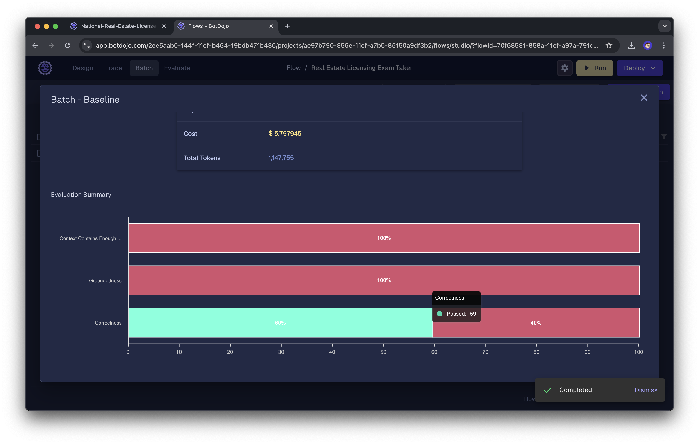

Used datalab to convert PDF to Markdown.

https://www.datalab.to/api/v1/marker/1283535

jq -r '.markdown | gsub("\\\\n"; "\n")' data/National-Real-Estate-License-Exam-Prep-2025.json > data/National-Real-Estate-License-Exam-Prep-2025.md

Got Cursor to write some scripts to format questions and answers into a CSV.

Had to do some manual post-processing to fix up the questions and answers.

Set up a Conversational AI Assistant in BotDojo with a vector index of the exam prep book.

Ran evals against the questions and answers and it scored perfectly. Oops!

Removed the questions and answers from the exam prep book and placed it in a separate test dataset.

Ran evals again. Baseline scored 60%.

Noticed some false negatives in the evals. Found the root cause and wrote a custom eval for Multiple Choice questions.

Multiple Choice evals weren't working correctly in BotDojo. Reached out to Paul (CEO) and he helped me fix the issue during his lunch at County Line! Amazing resource.

Scoring 87% on 100 which is a "passing" grade (70%)!!!

I've been concerned about the LLM needing tool calls to answer the math questions. However, the math is simple enough for 4o to use step-by-step reasoning to arrive at the answer. However, there's still false positives because in the step-by-step reasoning mode, it ignores the request to only state A, B, C, or D. For example:

> A property is zoned in a protected wetlands area that allows 30% coverage of the land on the property. The **home** built on it **takes** up 20% and a shed takes up **another** 5%. The owners are looking to **install** a 500 sq ft deck in the backyard. If the lot is 1/3 of an acre. What would the **total** land coverage be including the deck **addition**?\nA) 30.4%\nB) 25.7%\nC) 28.8%\nD) 32.2%

It responds with:

> To calculate the total land coverage including the deck addition:\n\n1. The lot size is 1/3 of an acre. Since 1 acre = 43,560 square feet, 1/3 acre = 43,560 / 3 = 14,520 square feet.\n2. The home takes up 20% of the lot, and the shed takes up 5%, totaling 25% coverage without the deck.\n3. The deck is 500 square feet. To find the percentage of the lot this covers: (500 / 14,520) * 100 = 3.44%.\n4. Adding the deck's coverage to the existing 25% gives a total coverage of 28.44%.\n\nTherefore, the closest answer is C) 28.8%.\n

The answer is correct.